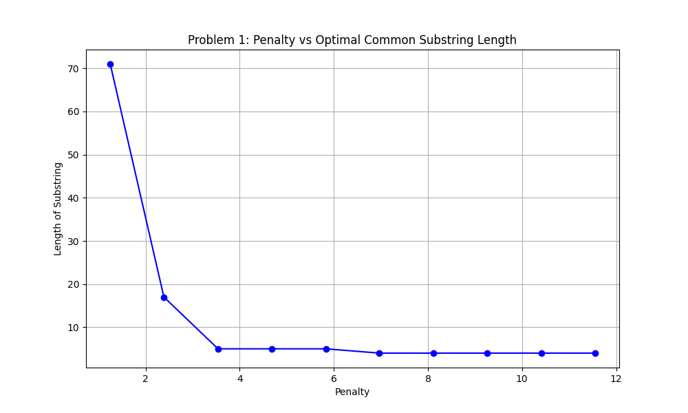
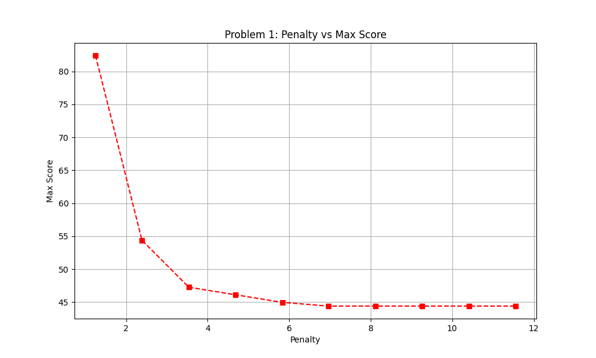
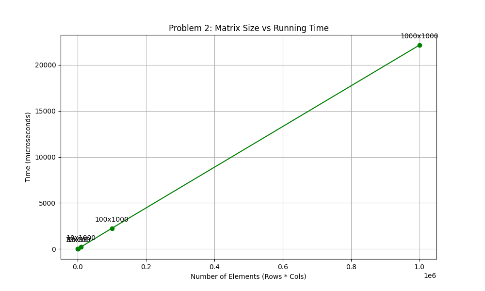
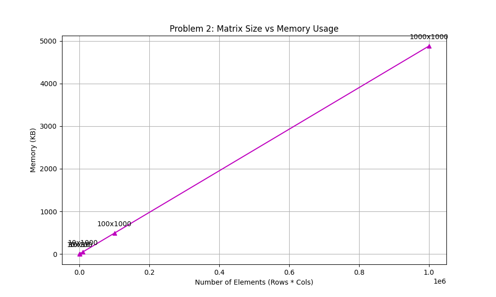

# Assignment 2 Report

## Problem 1: Weighted Approximate Common Substring

### 1. Algorithm Design
**Optimization Function:**
Maximize the score of a common substring $S_1[i..i+k-1]$ and $S_2[j..j+k-1]$, where the score is the sum of weights for matching characters minus penalties for mismatches.

**Bellman-Ford Equations:**
Let $DP[i][j]$ be the maximum score of a common substring ending at $S_1[i]$ and $S_2[j]$ (1-based indexing).

$$
DP[i][j] = \max \begin{cases} 
0 \\
DP[i-1][j-1] + w(S_1[i]) & \text{if } S_1[i] == S_2[j] \\
DP[i-1][j-1] - p & \text{if } S_1[i] \neq S_2[j]
\end{cases}
$$

**Justification:**
Since no gaps are allowed, a common substring ending at $(i, j)$ must extend the common substring ending at $(i-1, j-1)$. If the extension results in a negative score, it is better to start a new substring (reset to 0), similar to Kadane's algorithm for maximum subarray sum.

**Optimal Solution Extraction:**
1.  Find the maximum value in the entire $DP$ table. Let this be at $(i_{max}, j_{max})$.
2.  Backtrack from $(i_{max}, j_{max})$ diagonally ($i-1, j-1$) until $DP[i][j] == 0$.
3.  The sequence of characters encountered corresponds to the optimal substring.

### 2. Complexity Analysis
**Time Complexity:** $O(N \times M)$
We iterate through the DP table of size $(N+1) \times (M+1)$ once, performing constant time operations at each cell.

**Space Complexity:** $O(N \times M)$
We store the full DP table.
*Note: If only the max score was needed, we could optimize to $O(\min(N, M))$ space, but extracting the substring requires backtracking or storing start indices.*

### 3. Experimental Results

**Scenario 1 (Constant Weights)**
*   $w=1, p=2$
*   Input Lengths: 1000, 1000
*   Max Score: 4 (Example run)

**Scenario 2 (Frequency-based Weights)**
*   Weights proportional to English letter frequency ($E \approx 12.7, Z \approx 0.1$).
*   Penalty $p$ varied from $0.1$ to $12.7$.

| Penalty | Max Score | Match Length |
| :--- | :--- | :--- |
| 1.25 | 95.54 | 94 |
| 2.39 | 72.74 | 12 |
| 3.54 | 68.15 | 12 |
| 4.68 | 63.57 | 12 |
| 5.83 | 58.99 | 12 |
| 6.97 | 54.41 | 12 |
| 8.12 | 53.00 | 5 |
| 9.26 | 53.00 | 5 |
| 10.41 | 53.00 | 5 |
| 11.55 | 53.00 | 5 |

*Observation: As penalty increases, the optimal substring length decreases, favoring shorter, high-weight matches.*

---

## Problem 2: Largest Zero Sub-matrix

### 1. Algorithm Design
**Optimization Function:**
Maximize $k$ such that there exists a $k \times k$ sub-matrix of all zeros.

**Bellman-Ford Equations:**
Let $DP[i][j]$ be the side length of the largest square sub-matrix of zeros ending at $(i, j)$ (bottom-right corner).

$$
DP[i][j] = \begin{cases} 
0 & \text{if } Matrix[i][j] \neq 0 \\
\min(DP[i-1][j], DP[i][j-1], DP[i-1][j-1]) + 1 & \text{if } Matrix[i][j] == 0
\end{cases}
$$

**Justification:**
For a square of size $k$ to end at $(i, j)$, the cells $(i-1, j)$, $(i, j-1)$, and $(i-1, j-1)$ must be the bottom-right corners of squares of size at least $k-1$. The size is limited by the smallest of these neighbors.

**Optimal Solution Extraction:**
1.  Find the maximum value $k_{max}$ in the $DP$ table at indices $(r, c)$.
2.  The square sub-matrix is defined by top-left $(r - k_{max} + 1, c - k_{max} + 1)$ and bottom-right $(r, c)$.

### 2. Complexity Analysis
**Time Complexity:** $O(M \times N)$
We iterate through the matrix once.

**Space Complexity:** $O(M \times N)$
We store the DP table.
*Note: Can be optimized to $O(N)$ space if we only need the size, but storing the full table is standard for solution extraction.*

### 3. Experimental Results

| Matrix Size | Time ($\mu s$) | Max Square Size | Memory (KB) |
| :--- | :--- | :--- | :--- |
| 10 x 10 | 6 | 2 | 0.49 |
| 10 x 100 | 29 | 2 | 4.88 |
| 10 x 1000 | 332 | 3 | 48.83 |
| 100 x 1000 | 3962 | 4 | 488.28 |
| 1000 x 1000 | 24646 | 5 | 4882.81 |

*Observation: Running time grows linearly with the number of elements ($M \times N$). Memory usage also grows linearly.*
